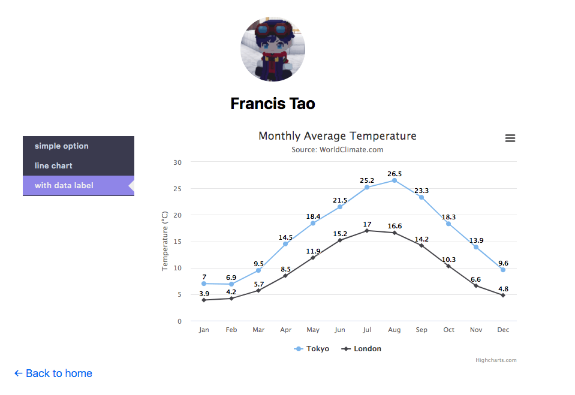

# Nextjs and Highcharts setup

This is a demo show how to use Highchart in Next.js project.



## Thing to notice

when you are using Highchart in ReactJs/nextjs project, you can use `HighchartsReact` alone with `Highcharts`.

`HighchartsReact` is a React component which receive two props: `highcharts object` and `options`.

In nextjs project, You need to check if the current environment is in the browser before calling `HighchartsExporting(Highcharts)`.

```javascript
import Highcharts from 'highcharts';
import HighchartsExporting from 'highcharts/modules/exporting';
import HighchartsReact from 'highcharts-react-official';

if (typeof Highcharts === 'object') {
    HighchartsExporting(Highcharts)
}
```

when you are using react hook's `useState` to change the option object, you can't just use the same `HighchartsReact` component, since the `HighchartsReact` could cache the previous options.
It is better to create a new `HighchartsReact` whenever the option state has changed.
```javascript
<div>
    {
        chartOptName.map((value, idx) => {
            if ( options === chartOptName[idx]) {
                return <HighchartsReact
                    key={idx}
                    highcharts={Highcharts}
                    options={chartOptions[options]}
                />;
            } else {
                return null;
            }
        })
    }
</div>
```